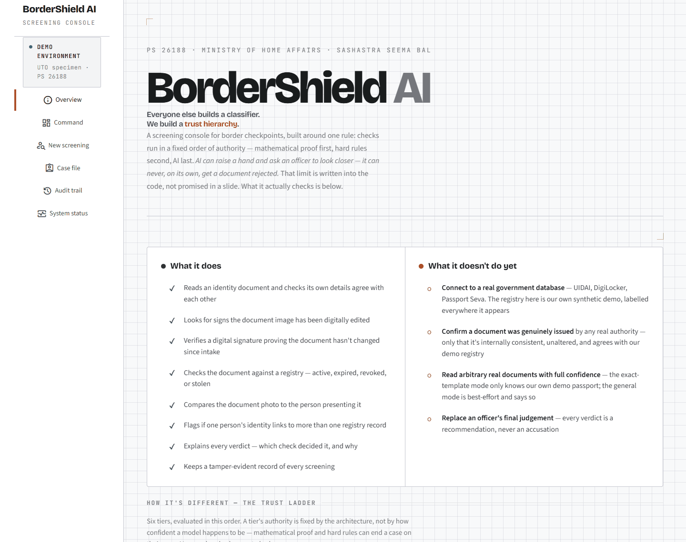
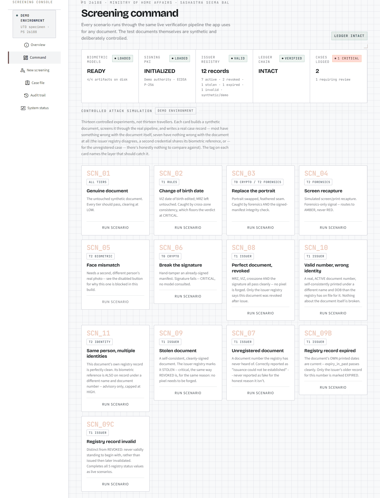
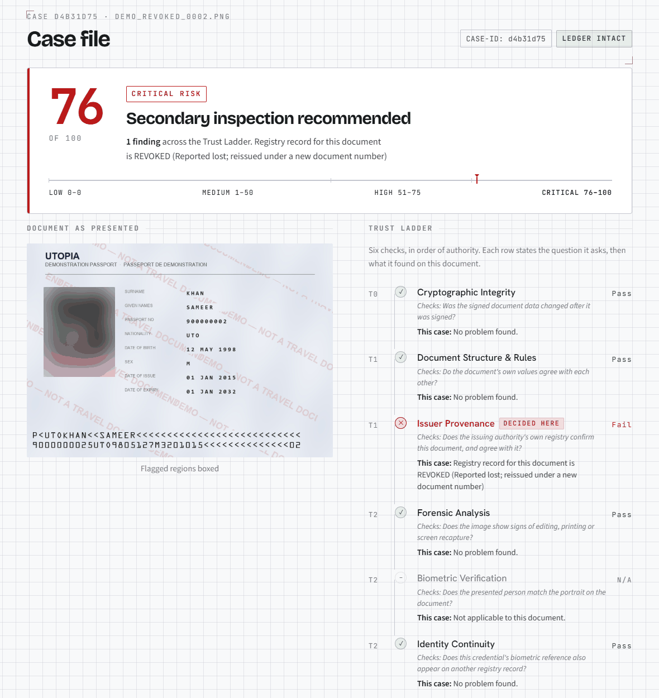
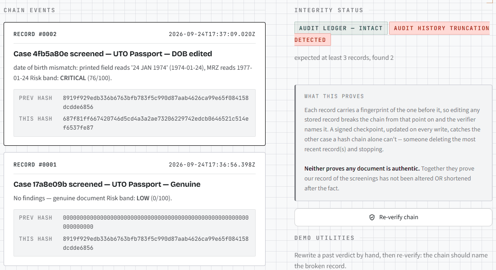

# BorderShield AI

**A screening console that helps a border officer decide whether an identity document deserves a closer look, and always explains why.**

Smart India Hackathon 2026 · Problem Statement **26188**, *AI-Based Fake Identity & Document Screening System* · Ministry of Home Affairs, Sashastra Seema Bal · Software · Blockchain & Cybersecurity

### [Open the live demo](https://sih-2026-bordershield-gtdxv2ktbsd5ekfyh2qm58.streamlit.app/)

No sign-in, nothing to install. If the app has been idle it may show a "wake up" button. Press it and give it a minute. Everything in it is synthetic demo data (details under [What is real and what is demo](#what-is-real-and-what-is-demo)).

---

## The idea, in plain words

An officer is looking at a passport. Something could be wrong in three ways: the document was **edited**, it was **never genuinely issued** (or was cancelled since), or it **belongs to someone else**.

Most "AI document checkers" hand the officer a single number, such as "87% fake", from one machine-learning model. That is a black box, and these models get much worse on documents they have not seen before: the best system in the 2026 document-forgery detection competition still made errors on about a quarter of unseen documents (26.52% EER, source in [`docs/01-RESEARCH.md`](docs/01-RESEARCH.md)). At a border, a wrong verdict is either a real person wrongly stopped or a forger waved through.

BorderShield is built around one rule instead: **checks run in a fixed order of authority. Mathematical proof first, hard rules second, AI last.** AI can raise its hand and ask an officer to look closer. It can never, on its own, get a document rejected. That limit is enforced in the code (`core/risk.py`), and covered by tests, not just promised in a slide.

### The Trust Ladder: six checks, in order of authority

| # | Check | The plain question it asks | Can it decide alone? |
|---|---|---|---|
| 1 | Cryptographic integrity | Has the signed data changed since it was signed? | **Yes**, pass or fail |
| 2 | Document structure & rules | Do the document's own numbers and fields agree with each other? | **Yes, but only against**: it can condemn, never clear |
| 3 | Issuer provenance | Does the issuing authority's registry confirm this document, and agree with it? | **Yes, but only against** |
| 4 | Forensic analysis | Does the image look edited, printed, or re-photographed off a screen? | No. Advisory, never above HIGH |
| 5 | Biometric verification | Does the person presenting it match the portrait? | No. Advisory, never above HIGH |
| 6 | Identity continuity | Is this person's face tied to a *different* identity in the registry? | No. Advisory, never above HIGH |

The result is a score out of 100 in four bands (LOW 0, MEDIUM 1–50, HIGH 51–75, CRITICAL 76–100) and a recommended action. Every case page shows which check decided it and why.

---

## See it working in two minutes

Open the [live demo](https://sih-2026-bordershield-gtdxv2ktbsd5ekfyh2qm58.streamlit.app/), then:

1. **Overview** is the front page. Read the two boxes: *what it does* and *what it doesn't do yet*.
2. Go to **Command** and press **Run scenario** on **Genuine document**. The Case file opens: score **0, LOW**, every check passes.
3. Back on Command, run **Change of birth date**. The printed date of birth was edited, but the machine-readable strip at the bottom of the passport still holds the original. The rules catch the mismatch: **CRITICAL, 76/100**.
4. Run **Perfect document, revoked**. This is the one to remember. Nothing is forged: the signature is valid, the fields agree, the image is clean. It is still **CRITICAL (76/100)**, because the issuer registry says the document was revoked after it was issued. The Case file marks *Issuer Provenance* as **"decided here"**. A detector that only looks at pixels would have passed this document.
5. Open **Audit trail** and press **Simulate truncation** (run a scenario or two first, so there is a record to delete). This deletes the newest record. The chain of hashes on its own still looks fine, but a separate signed checkpoint notices and raises a red **audit history truncation detected** flag, with a line such as "expected at least 3 records, found 2".

The audit trail on the live demo is a single file on the demo server, so visitors share it. **Reset ledger** on that page clears it.

### What you will see

**Overview**: what it does, and what it honestly doesn't do yet.


**Command**: five live status cards, then thirteen controlled attack scenarios. Each one builds a synthetic document, runs it through the real pipeline, and writes a real case record.


**Case file**: the verdict, and the six-row ladder that produced it. Here a document with nothing forged is stopped only by the registry. (The portrait is blurred in this screenshot.)


**Audit trail**: two independent integrity checks. Here the ledger is intact record by record, yet the missing newest record is still caught.


---

## What it does, and what it doesn't do yet

| It does | It doesn't do yet |
|---|---|
| Reads an identity document and checks its own details agree with each other | **Connect to a real government database** (UIDAI, DigiLocker, Passport Seva). The registry here is our own synthetic demo, labelled everywhere it appears |
| Looks for signs the document image has been digitally edited | **Confirm a document was genuinely issued** by any real authority. Only that it is internally consistent, unaltered, and agrees with our demo registry |
| Verifies a digital signature proving the document hasn't changed since intake | **Read arbitrary real documents with full confidence.** The exact-template mode only knows our own demo passport. The general mode is best-effort and says so |
| Checks the document against a registry: active, expired, revoked, or stolen | **Replace an officer's final judgement.** Every verdict is a recommendation, never an accusation |
| Compares the document photo to the person presenting it | |
| Flags if one person's identity links to more than one registry record | |
| Explains every verdict: which check decided it, and why | |
| Keeps a tamper-evident record of every screening | |

### Two ways to screen a document

- **Demo document.** Our synthetic "Utopia" passport in a fixed layout, plus the thirteen attack scenarios above. Because we sign these documents ourselves, this mode can use every rung of the ladder, including cryptographic proof and the registry.
- **Real document** (New screening → Real Document). Upload any identity or educational document as an image or PDF. It reads the text with OCR, finds a portrait, and runs only the checks the document actually supports. Each check says whether it ran. It can never reach CRITICAL (that needs cryptographic proof, which an arbitrary upload doesn't have). A clean result reads **"No adverse signals"**, never "genuine". An optional second document lets it cross-check the date of birth: two independently issued documents agreeing is real corroborating evidence, with no government database required. Uploads are decoded in memory and never written to disk.

---

## What is real and what is demo

| Part | What is real | What is demo |
|---|---|---|
| Documents | The screening pipeline runs on the actual pixels | The passports are synthetic ("Utopia"). No real person's government ID is in this repository. The demo portrait is a consenting volunteer's photo, used to test face matching |
| Digital signature | Real cryptography: a two-level X.509 certificate chain and ECDSA P-256 signatures | The trust anchor is our own demo authority, not a government's. It proves the document is **unchanged since intake**, not **who issued it** |
| Issuer registry | A real SQLite database with a signed integrity manifest, and a plug-in interface for a real connector | The records are our own synthetic data, not UIDAI, DigiLocker, or Passport Seva |
| Audit trail | Hash-chained log plus a signed record-count checkpoint. Editing a record breaks the chain, and deleting the newest record breaks the checkpoint | **Not a blockchain.** Someone holding the signing key *and* write access could still regenerate a shorter chain. That boundary is stated, not hidden |
| Face matching | Real detection and embedding models (YuNet, SFace) | The match threshold (0.363) is the model publisher's default, not something we tuned on our own data |
| Forensics | Four image checks: photo-region, noise, screen-recapture, and error-level analysis | Error-level analysis is shown but never scored, because it is known to be unreliable. In real-document mode, forensic failures are downgraded to advisory because their thresholds were calibrated on the synthetic passport only |

One scenario is deliberately switched off: **Face mismatch** needs a *second, different* person's consenting photo, which we don't have on file. Face **match** is verified working end to end.

---

## Run it on your own computer

Windows PowerShell, with Python installed (developed and tested on Python 3.13):

```powershell
git clone https://github.com/Rajveer-code/sih-2026-bordershield.git
cd sih-2026-bordershield
python -m venv venv
.\venv\Scripts\pip install -r requirements.txt
.\venv\Scripts\python.exe -m pytest tests/ -q       # expect 169 passed
.\venv\Scripts\python.exe -m streamlit run app.py
```

Nothing else to set up. The demo passport, the attack documents, and the face models are already in the repository, so there are no downloads. On first start the app creates its own demo signing keys and signs the demo documents on your machine.

---

## Built with

| Layer | Tools |
|---|---|
| App and interface | Python, Streamlit |
| Computer vision and face | OpenCV (contrib), ONNX Runtime, YuNet (detection) and SFace (matching) from the OpenCV Zoo |
| OCR and PDFs | RapidOCR (ONNX backend), PyMuPDF |
| Cryptography | Python `cryptography`: X.509 certificates, ECDSA P-256 |
| Registry and data | SQLite, Pydantic, YAML (`core/rules/policy.yaml` holds every weight, band, and rule) |
| Quality | pytest: **169 automated tests, all passing** |
| Hosting | Streamlit Community Cloud (free tier). Streamlit needs a long-running server process, so serverless hosts don't fit |

## Where things live

| Path | What's in it |
|---|---|
| `app.py`, `ui/` | The Streamlit console |
| `core/` | The screening engine: reading, rules, forensics, face, crypto, issuer registry, risk fusion |
| `core/realdoc/` | The separate pipeline for arbitrary real documents |
| `synth/` | Generates the synthetic demo passport and the attack documents |
| `tests/` | The 169 tests |
| `docs/DEVELOPER.md` | How it is wired, deployed, and tested (for anyone reading the code) |
| `docs/team/current-state.md` | Every screen and button: what is real, what is disabled, what is not built |

## Where this goes next

- Plug in a connector to a real issuing-authority registry. The interface already exists (`core/issuer/`), and only the data source is synthetic.
- Read documents that aren't neatly labelled, including Indian-language layouts. Field extraction today is rule-based and works best on labelled fields.
- Turn on the face-mismatch scenario once a second consenting person's photo is available.

---

*More background:* [`docs/DEVELOPER.md`](docs/DEVELOPER.md) (technical detail), [`docs/team/current-state.md`](docs/team/current-state.md) (feature-by-feature status), [`docs/01-RESEARCH.md`](docs/01-RESEARCH.md) (evidence base). The earlier planning documents in `docs/` predate the final scope cut; where they disagree with the code or `docs/DEVELOPER.md`, the code is the source of truth.
